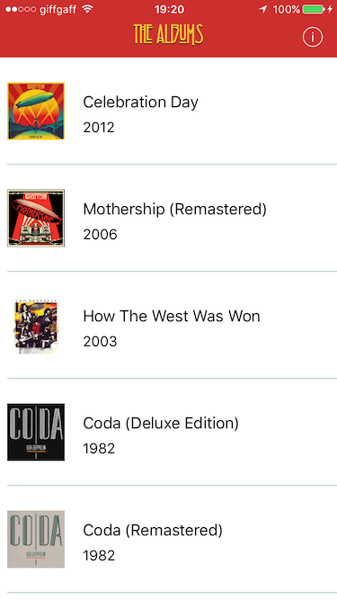

####Test for notonthehighstreet.com iOS Developer

1. Fetch albums from Spotify API
2. Fetch individual album information
3. Lazy loading of images
4. Display data within a UITableView
5. Pull to refresh
6. Autolayout
7. Error handling
8. Navigation bar customisation

####Some screenshots

